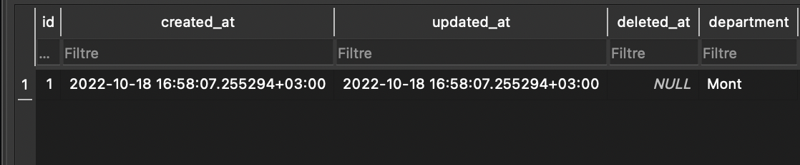

# Gorm


**Gorm** kütüphanesi sql kullanımını kolaylaştıran ve az kod ile çok iş yapabileceğiniz bir kütüphanedir. **Gorm** kütüphanesini yüklemek için komut satırına  aşağıdakileri yazın.

```
go get -u gorm.io/gorm
```

### Gorm Özellikleri&#x20;

* Tam Özellikli ORM
* Hooks (oluşturma/kaydetme/güncelleme/silme/bulmadan önce/sonra)
* Preload, Joins ile istekli yükleme
* İşlemler, İç İçe İşlemler, Kaydetme Noktası, Kaydedilen Noktaya Geri Dönme
* Bağlam, Hazırlanan İfade Modu, DryRun Modu
* Toplu Ekleme, FindInBatches, Map ile Bul/Oluştur, SQL Expr ve Context Valuer ile CRUD
* SQL Builder, Upsert, Locking, Optimizer/Index/Comment İpuçları, Adlandırılmış Bağımsız Değişken, Alt Sorgu
* Bileşik Birincil Anahtar, Dizinler, Kısıtlamalar
* Otomatik Taşıma
* Genişletilebilir, esnek eklenti API: Database Resolver (birden çok veritabanı, okuma/yazma bölme) / Prometheus…
* Geliştirici Dostu

Gorm kütüphanesini kullanabilmemiz için bir sql dili seçmemiz gerekmektedir. Bu öğreticide sqlite kullanacağız. Sqlite kütüphanesini yüklemek için komut satırına aşağıdakileri yazın.

```
go get -u gorm.io/driver/sqlite
```


**Gorm Kütüphanesinin Kullanımı**\
**main.go** dosyamızı oluşturalım. Kütüphanelerimizi import edelim.

```go
import (
	"fmt"
	"gorm.io/driver/sqlite"
	"gorm.io/gorm"
)
```

"gorm.io/gorm" kütüphanesi ile gorm fonksiyonlarına erişiyoruz. Gorm ile sqlite entegrasyonunu sağlamak için ise "gorm.io/driver/sqlite" kütüphanesini kullanıyoruz bu kütüphane kullandığını sql diline göre değişiklik göstermektedir. Şimdi basit şekilde veri tabanı bağlantısı ve crud işlemleri nasıl yapılır görelim.

Gorm da manuel olarak tablo oluşturmanız gorm işleyişine tersdir. Bunun yerine bir struct oluşturacağız ve struct içerisine deki özelliklere göre gorm otomatik tablo oluşturacaktır. Struct otomatik tablo çıktı almak için struct içerisinde en üste "gorm.Model" eklentisini eklememiz gerekmektedir.

```go
type User struct {
	gorm.Model
	Username string `gorm:"not null;size:30"`
}

```

sqlite bağlanmak için bizden bir veritabanı adı istiyor bu veritabanını kendi otomatik oluşturacaktır;

```go
db, _ := gorm.Open(sqlite.Open("data.db"), &gorm.Config{})
```

Oluşturmuş olduğumuz struct ile AutoMigrate() fonksiyonunu kullanarak tablo oluşturalım. Create() fonksiyonu ile oluşturulan tablomuzun içerisine bir name ekleyelim.

```go
func main() {
	db, _ := gorm.Open(sqlite.Open("veri.db"), &gorm.Config{})
    	defer db.Close()
	db.AutoMigrate(&User{}) // Tablo oluşturma
	
	db.Create(&User{Username: "eren"}) // Tablo içerisine insert
}
```

Sqlite tablomuz bu şekilde gözükmelidir. Gorm otomatik olarak oluşturma, güncelleme ve silinme tarihlerini belirten sütunlar eklemektedir.

<figure><figcaption></figcaption></figure>

Tablomuza bir veri daha ekleyelim tablo içerisinde id ile arama yapabilmek için "First()" fonksiyonunu kullanacağız sonucu terminalden alalım.&#x20;

```go
func main() {
	db, _ := gorm.Open(sqlite.Open("veri.db"), &gorm.Config{})
    	defer db.Close()
	db.AutoMigrate(&User{}) // oluşturma

	db.Create(&User{Username: "furkan"}) //ekleme

	var users User 
	db.First(&users, 2) // id 2 olan kullanıcı getirilecektir.
	fmt.Println(users)
}

```

Tablomuzun içerisinde ki tüm kullanıcıları almak için 1 değişiklik yapacağız "var users \[]User" dizi olarak değiştiriceğiz ve "Find()" fonksiyonunu kullacağız.

```go
func main() {
	db, _ := gorm.Open(sqlite.Open("data.db"), &gorm.Config{})
    	defer db.Close()
	var users []User
	
	db.Find(&users)
	fmt.Println(users)
}

```

Tablomuzun içerisinde güncelleme yapalım bunun için ilk olarak "First()" fonksiyonu ile güncelleme yapacağımız kullanıcının id sini ekliyoruz daha sonra model içerisinde updates özelliğini kullanarak yeni alacağı veriyi giriyoruz.

```go
func main() {
	db, _ := gorm.Open(sqlite.Open("data.db"), &gorm.Config{})
    	defer db.Close()
	var users User
	
	//güncelleme
	db.First(&users, 1) // Eren
	db.Model(&users).Updates(User{Username: "Golang"})
	fmt.Println(users)
}

```

Gorm da iki tür silme işlemi yapacağız bir id sadece 1 kullanıcıyı silecektir ikincisi özellik ile toplu silme.

```go
func main() {
	db, _ := gorm.Open(sqlite.Open("data.db"), &gorm.Config{})
    	defer db.Close()
	var users User

	//silme
	db.Delete(&users, 1) // id 1 olan kullanıcı silinecektir.
	fmt.Println(users)

}

```

Where ile username sorgusu yapacağız ve username Emre olan tüm kullanıcıları silecektir.

```go
func main() {
	db, _ := gorm.Open(sqlite.Open("data.db"), &gorm.Config{})
    	defer db.Close()
	var users User
	name := "Emre"
	db.Model(users).Where("username = ?", ""+name+"").Delete(&users)
	fmt.Println(users)

}

```

### Silinen Verileri Getirme

Gorm ile silinen verileri getirme işlemini "Unscodep()" fonksiyonu ile yapabiliyoruz. İd ile ve tümünü getirme olarak işleyeceğiz id olarak almak istediğimiz de "First()", tümünü istediğimiz de "Find()" fonksiyonlarını kullanacağız.

```go
func main() {
	db, _ := gorm.Open(sqlite.Open("data.db"), &gorm.Config{})

	// id ile getirme
	//****
	var userid []User
	db.Unscoped().First(&userid, 2)
	fmt.Println(userid)
	//****
	
	// Tümünü getirme
	//****
	var users []User
	db.Unscoped().Find(&users).Unscoped()
	fmt.Println(users)
	//****
}

```

### Related(ilişkisel) Gorm

İlişkisel veritabanları biri birine bağlı en az iki tane tablonun işlenmesi demektir. İlişkisel veritabanın Related özelliğini kullanabilmek için farklı iki kütüphane seçtim. Related işlemleri için gorm ve sqlite3 kütüphanesini yüklemek için komut satırına aşağıdakileri yazın.

```
go get -u github.com/jinzhu/gorm
go get -u github.com/mattn/go-sqlite3
```

**Gorm Kütüphanesi ile Related Kullanımı**\
**main.go** dosyamızı oluşturalım. Kütüphanelerimizi import edelim.

```go
import (
	"github.com/jinzhu/gorm"
	_ "github.com/mattn/go-sqlite3"
)
```

İlişkisel tablolar oluşturabilmek için iki tane struct ekleyelim ve bu struct' lar arasında ki bağlantıya dikkat edelim.&#x20;

```go
type Category struct {
	gorm.Model
	Department string `gorm:"not null;size:30"`
	Products   []Product
}

type Product struct {
	gorm.Model
	CategoryID int    `gorm:"index"`
	Name       string `gorm:"type:varchar(50);unique_index"`
}
```

Category ye bağlı bir Product tablosu oluşturduk Product içersinde ki CategoryID içerisine bir veri eklemeyeceğiz başına ID koyduğumuzda ilişkisel bir veritabanı oluştururken otomatik Category de oluşturuduğumuz satırların ID si gelecektir. İşlemlere geçerek daha detaylı bakalım.

```go
func main() {
	db, _ := gorm.Open("sqlite3", "data.db")
    	defer db.Close()
	db.AutoMigrate(&Category{}, &Product{})

	db.Model(&Category{}).Related(&Product{})

	products := []Product{
		Product{Name: "A"},
		Product{Name: "B"},
		Product{Name: "C"},
	}

	created := Category{Department: "Mont", Products: products}
	db.Create(&created)

}

```

İlk olarak sqlite ile bağlantı kuruyoruz. AutoMigrate() fonksiyonu ile iki tablomuzuda oluşturuyoruz. Daha sonra "Model(\&Category{})" ile ana tablomuzu seçtik ana tablomuza ilişkili olan tablomuzu da "Related(\&Product{})" olarak ekliyoruz. Product içerisine A,B,C şeklinde bir kaç değer giriyoruz. Bu verilerin tabloya ekleyeceğiz ama hangi Department ile ilişkili olucağını da belirtmemiz gerekmektedir aksi takdirde "CategoryID" si 0 olacaktır. Category içerisinde bağlı olduğu Department 'ı da seçerek ve bunları bir bütün olarak create tabir tutuyoruz.

<figure><figcaption></figcaption></figure>

<figure><figcaption></figcaption></figure>

<figure><figcaption></figcaption></figure>
